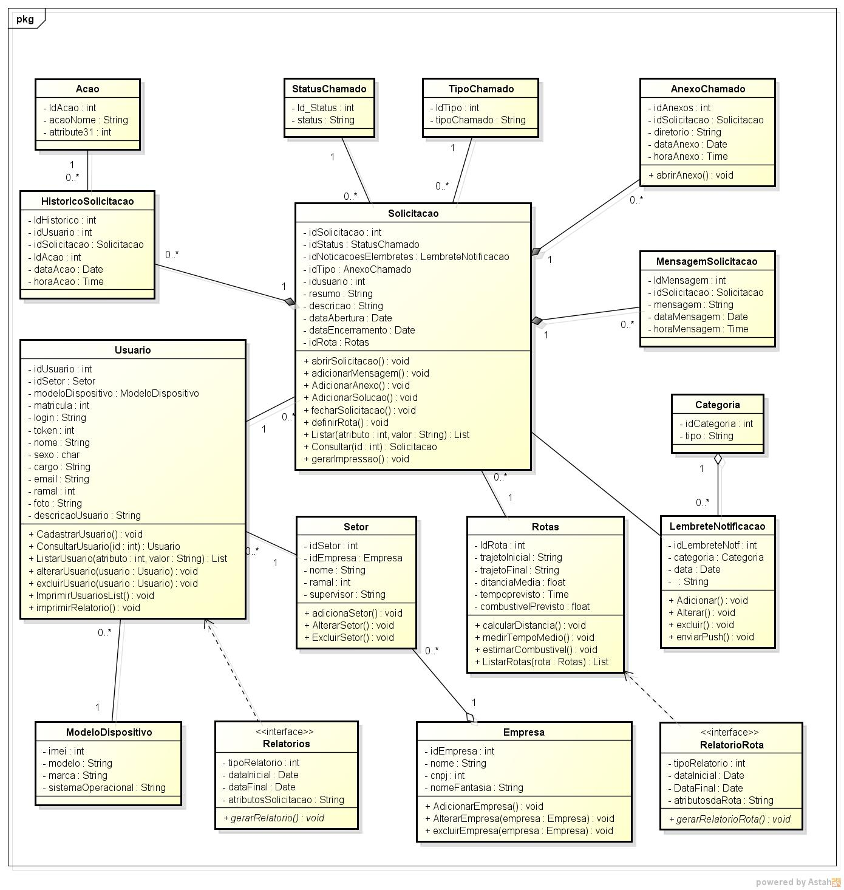

# Sistema de Consultas e exames - Laravel

##Introdução

Esboço de um simples sistema de consultas e exames clinicos.

## Ações disponiveis

CRUD de usuário com 3 niveis diferentes de acesso(Amin,paciente e profissional da saúde)

CRUD de consultas, exames e serviços médicos

Recuperação de senha, envio de email de recuperação de senha(mailChip)

Para envio de email, substitua os seguintes itens no arquivo .env :

	MAIL_DRIVER=smtp
	MAIL_HOST=smtp.gmail.com
	MAIL_PORT=465
	MAIL_USERNAME=thelesson.souza@gmail.com
	MAIL_PASSWORD=SUA_SENHA
	MAIL_ENCRYPTION=ssl

## ScreenShots

## Instalação

Abrir o arquivo .env e substituir as linhas : DB_DATABASE=SUA_BASE_DE_DADOS /// DB_USERNAME=SEU_NOME_DE_USUARIO /// DB_PASSWORD=SUA_SENHA

Para logar-se como ADMIN, acesse a url http://SEU_LOCAL_HOST/admin/login

Login e senha padrão: *login:* admin // *senha:*admin ou *login:* thelesson.souza@gmail.com *senha:*admin

## License

The Laravel framework is open-sourced software licensed under the [MIT license](http://opensource.org/licenses/MIT).
